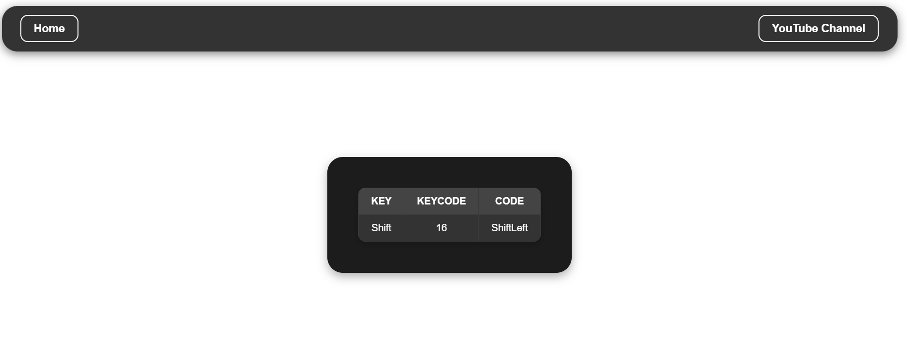

```markdown
# Keyboard Check  

A lightweight and interactive web application that detects and displays key presses and releases in real-time. Ideal for testing keyboard inputs, debugging key events, or experimenting with JavaScript's `keydown` and `keyup` event listeners.

---

## Features  

- **Real-Time Key Detection**  
  - Displays the key and its associated keycode whenever a key is pressed.  

- **Key Release Handling**  
  - Captures and responds to key release events.  

- **Clear Button**  
  - Clear the key log display with a single click.  

- **Stylish Interface**  
  - Simple, responsive, and visually appealing design.  

- **Accessible**  
  - Keyboard navigation and ARIA support for enhanced accessibility.  

---

## Technologies Used  

- **HTML**: Structuring the application layout.  
- **CSS**: Adding styles and animations for a modern look.  
- **JavaScript**: Handling key press and release events dynamically.  

---

## How to Use  

1. Clone this repository:  
   ```bash
   git clone https://github.com/Safdar-Ali-India/keyboard-check.git
   ```
2. Navigate to the project folder:  
   ```bash
   cd keyboard-check
   ```
3. Open `index.html` in your favorite browser.  
4. Press any key on your keyboard to see it displayed in real-time!  

---

## Project Structure  

```plaintext
keyboard-check/
├── assets/ screenshot.png        # Main HTML file
├── index.html        # Main HTML file
├── styles.css        # Styling for the application
├── script.js         # JavaScript logic for key detection
└── README.md         # Documentation
```

---

## Preview  

  
_A simple interface to check your keyboard's functionality._  

---

## Future Improvements  

- Add support for mouse event detection.  
- Include a virtual keyboard for on-screen testing.  
- Add themes to customize the UI.  
- Display key combinations (e.g., `Ctrl + C`).  

---

## Contributing  

Contributions are welcome! Feel free to fork the repo, submit pull requests, or open issues for suggestions.  

---

### Author  

[Safdar Ali](https://github.com/Safdar-Ali-India/)  
Passionate about creating fun and useful web tools.
```